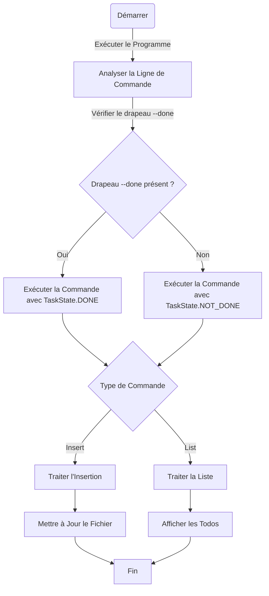

# L3 design pattern report

- **Firstname**: DJOUE
- **Lastname**: ARIEL EMMANUEL KOUADIO


---

## TP1
 - La première tâche du script est de s'occuper des options passer en ligne de commande et de renvoyer une erreur 
 en fonction du résultat. On va d'abord séparer l'analyse des arguments de la gestion des erreurs avec la classe
```java
static class CommandLineProcessor implements CommandProcessor {}
```
- On va maintenant implémenter une fonction spécifique pour récupérer l'argument passer en ligne de commande
```java
static class MyCommandProcessor {}
```
- Plus bas dans le code, je me suis rendu compte qu'il fallait aussi récupérer le reste des arguments de la ligne de
commande 😅. 

    J'ai donc ajouté l'interface :
```java
interface ArgumentValidator {}
```
et une classe : 
```java
static class PositionalArgumentValidator implements ArgumentValidator {}
```
Afin de respecter le principe ```SOLID```. Le but est de vérifier s'il y'a des arguments présents.

J'ai par conséquent ajouté quelqus instructions à la méthode :
```java
public int processCommand(CommandLine cmd) {}
```
de la classe :
```java
static class CommandLineProcessor implements CommandProcessor {}
```
pour gérer les erreurs.
 
- Pour ce qui est de la récupération du contenu du fichier, j'ai suivi le même principe en séparant la vérification
du chemin de la lecture du fichier respectivement avec les classes suivantes :
```java
static class PathValidator {}

static class FileReader {}
```
- Pour ce qui est de la suite du script, on utilise une structure conditionnelle pour vérifier si la commande vaut
```insert``` ou ```list```. Dans l'optique ou par exemple nous voudrons rajouter d'autres commandes, on aura beaucoup 
trop de ``` if ```. 

J'ai donc trouver plus judicieux de remplacer cela par une table de correspondance depuis 
laquelle nous pourrons modifier nos commandes.
```java
private static Map<String, Command> commandRegistry = new HashMap<>();
static {
        commandRegistry.put("insert", new InsertCommand());
        //...
    }
 ```
> **NOTE** : Je ne connaissais pas cette manière de faire 😂, c'est lors de mes recherches que j'ai vu cette méthode 
> au lieu d'utiliser une structure ```switch``` qui n'étais pas forcément approprié comme vous l'avez dit en cours.
- Pour que la table de correspondance puisse fonctioner, j'utilise la fonction ```createCommandExecutor(command)``` 
qui renvoie l'instance de la commande si elle existe dans la table de correspondance.
- Pour ce qui est des classes spécifique à chaque commande, la même méthode est utilisée. Une interface de base, dans
notre cas ```Command``` et les classes spécifique. Par exemple ```InsertCommand```
- Et maintenant pour ce qui est du procéder de lecture et d'insertion il faudra juste faire des méthodes privées
spécifiqiues à chaque classe en fonction de l'extension du fichier (```csv``` ou ```json```). Sans oublier de précisé
le fonctionnement dans la méthode ```execute```
> ### Exemple
> ```java
> static class InsertCommand implements Command {
>    @Override
>    public int execute(List<String> positionalArgs, Path filePath) {}
>    private void processJsonInsertCommand(Path filePath, String todo) {}
>    private void processCsvInsertCommand(Path filePath, String todo) {}
> }
> ```
 
- Je vais maintenant séparer le code final en différent ```package``` car le script deviens à mons sens
un peu trop lourd.
---

## TP2
- La tâche du jour est d'ajouter une fonctionnalité permettant de marquer une tâche comme ```done```.
Voici un petit diagramme qui explique comment la fonctionnalité marhcera dans le programme.


- La méthode ```execute``` prend un nouveau paramètre qui permet de spécifier si la commande contient 
l'option ```done```
```java
  public interface Command {
    int execute(List<String> positionalArgs, Path filePath, TaskState taskState) throws IOException;
    }
```
> **NOTE**
> 
> ```TaskState``` est une énumération ```enum```.
- Pour la structure des fichiers ```json```, j'utilise un nouveau format pour vérifier si la tâche est marquée comme
```done```
> ### Exemple
> ```json
> [
> "Hello world !",
> "Hello world !",
> "Hello world !",
> {"text":"First ToDo","done":true},
> {"text":"Just a done task","done":true}
> ]
> ```
 - Pour les fichiers ```csv```, les valeurs seront séparées par des points virgules ```;```


 - Mais le programme reste toujours rétro compatible.
> **NOTE**
> 
> Lors de l'exécution des GhostTest, j'ai remarqué que certains tests échouaient parceque lors de l'output, 
> certains Todo étaient encadrés par des doubles quotes ```"``` du côté de la sortie attendue. 
> J'ignore un peu d'où vient le problème.
---

## TP2 (update)

- Afin de rendre le code plus **viable** pas mal d'élément ont changé dans l'ensemble du programme.


- La classe ```InsertCommand``` n'est plus en charge de vérifier les instructions doivent s'exécuter dans un fichier 


- ```JSON``` ou ```CSV```. Pareil pour la classe ```ListCommand```. Elles font appel à une interface ```FileHandler``` 
qui est en charge de lancer les opérations de lecture où d'écriture 
(je ne suis pas sûr que cette interface le principe SRP, mais j'en reste là pour le moment.)


- Une classe ```Todo``` a aussi été implémenter, elle n'a pas grande utilité pour le moment mais elle sera plus utile 
dans le cas où nous voudrons insérer plusieurs Todos par exemple 🙂.


- Les classes suffixées par ```Factory``` ont juste pour rôle d'instancier des objets.

> **NOTE**
> 
> En ce qui concerne la class ```App```, j'ai comme un cruel ressenti d'amélioration mais je ne sais pas quoi faire 
> ni par où commencer 😓. 
